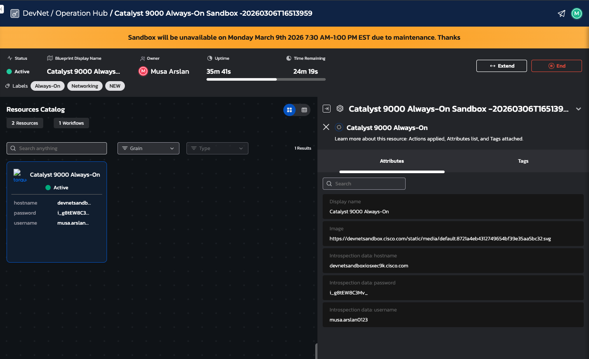
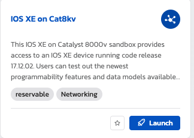

steps taken

create a virtual enviroment
install netmiko 

create a Cisco DevNet account 

make sure to select the correct veritual router

some routers like the one above are restricted to level 1 meaning that you cannot enter global configuration mode 

I will test with Cisco IOS XE DevNet Sandbox as recomended on forums. It seems that this image has full access to the router without restrictions 

# coding the automation

1. the steps that i want my code to take are:
2. Pick a device

3. Connect to it over SSH

4. Pull the running config

5. Check whether there is already an older backup

6. If there is an older backup, compare it to the new config

7. Show whether changes exist

8. Save the new config as the latest backup

